# Test Report
This git repository is a report for the iFollow Test.
## 1 Test Environment 
In this Test, ROS 1 Noetic was used under Ubuntu 20.04. 
To install ROS 1 Noetic under 20.04, please refer to : 
[Ubuntu install ROS Noetic](http://wiki.ros.org/noetic/Installation/Ubuntu)

For the simulation, Turtlebot3 burger model was used. Please refer to : 
[Turtlebot3 Noetic](https://emanual.robotis.com/docs/en/platform/turtlebot3/quick-start/).

To install dependent ROS packages, run: 
``` 
sudo apt-get install ros-noetic-joy ros-noetic-teleop-twist-joy \
  ros-noetic-teleop-twist-keyboard ros-noetic-laser-proc \
  ros-noetic-rgbd-launch ros-noetic-rosserial-arduino \
  ros-noetic-rosserial-python ros-noetic-rosserial-client \
  ros-noetic-rosserial-msgs ros-noetic-amcl ros-noetic-map-server \
  ros-noetic-move-base ros-noetic-urdf ros-noetic-xacro \
  ros-noetic-compressed-image-transport ros-noetic-rqt* ros-noetic-rviz \
  ros-noetic-gmapping ros-noetic-navigation ros-noetic-interactive-markers
```

To install Turtlebot3 packages, run:
```
sudo apt install ros-noetic-dynamixel-sdk
sudo apt install ros-noetic-turtlebot3-msgs
sudo apt install ros-noetic-turtlebot3
```

You can download Turtlebot3 simulations package from source [Here](https://github.com/ROBOTIS-GIT/turtlebot3_simulations.git).

First, launch a turtlebot3 burger model in empty world by executing the following: 
```
export TURTLEBOT3_MODEL=burger
roslaunch turtlebot3_gazebo turtlebot3_empty_world.launch
```

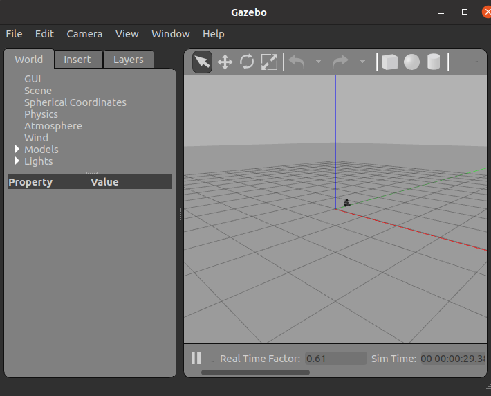

Then launch the navigation from the navigation packages: 
```
roslaunch turtlebot3_nav navigation.launch 
```

This launch file uses the amcl and move_base links to properly navigate the turtlebot in the map. The map was obtained using the lidar of the turtlebot. All these files can be found in folder "nav_robot".

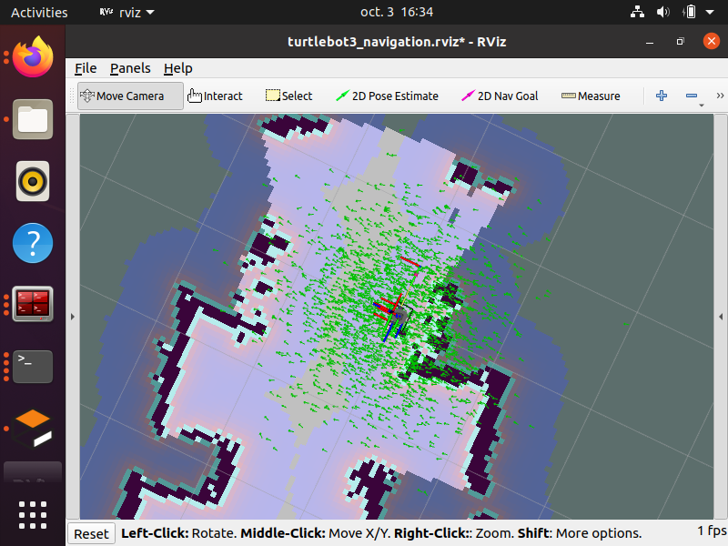

To run the teleoperation using the keyboard, use:
```
$ roslaunch turtlebot3_teleop turtlebot3_teleop_key.launch
```

To send navigation goals to the navigation goal stack, you can use the 2D Nav Goal in Rviz or run the following code to use move_base_msgs.msg:
```
cd src/scripts/Delivery/question1
python3 nav_goal.py
```

## 2 Command Multiplexer 
In this part, the addition of a multiplexer node that allows to switch between two speed topics and publish on cmd_vel topic.

To do so, Topic tools services is used to select a topic that publishes on cmd_vel. 
The mux node can be found in mux_node.py. 

From the catkin workspace you can find code file following the path: 
```
cd src/scripts/Delivery/question2
```

Then start the mux node: 
```
python3 mux_node.py
```

Then to start a node publishing on /cmd_local which publishes a constant speed command, run:
```
python3 move_forward.py
```
To start a node publishing on /cmd_web which allows the teleoperation with keyboard, run: 
```
python3 teleop_KB.py
```

To run the multiplexer of the two nodes, run: 
```
rosrun topic_tools mux cmd_vel cmd_local cmd_web mux:=mux_cmd_vel
```

To select the desired topic, run: 
```
rosservice call mux_cmd_vel/select "desired_topic"
```
The following figure shows when /cmd_local is selected.

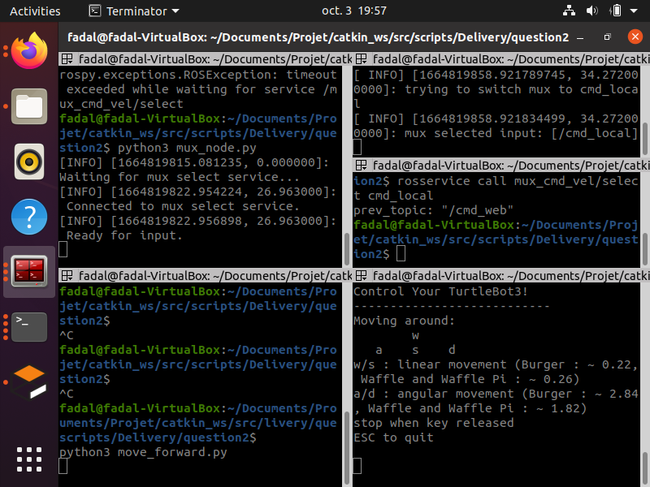

The following figure shows when /cmd_web is selected.

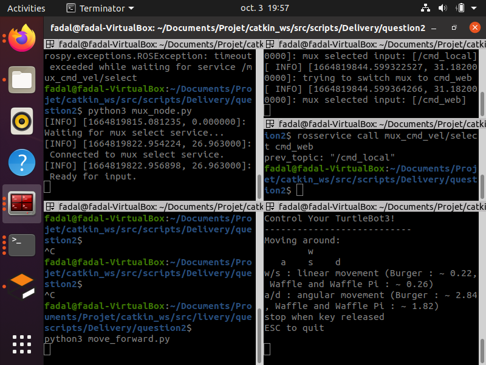

## 3 Remote Teleoperation 
To answer this question, MQTT protocol is used. 
First, go to folder:
```
cd src/scripts/Delivery/question3
```

Then run the mqtt subscriber which will listen to the keyboard and publish the command on python/mqtt topic by running:
```
python3 subscriber.py
```

The previous code can be on a machine with no ROS since it doesn't use ROS dependencies.

Next, run the publisher which will get the command from python/mqtt topic and publishes it on /cmd_vel. Run:
```
python3 publisher.py
```

The following figure shows the communication and message transfer between client and server.

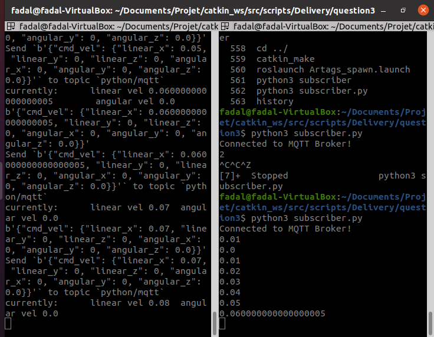

## 4 Ar Tags Track 
The first step was to spawn AR tags in gazebo. To do so, ar tags boxes were created using blender. 

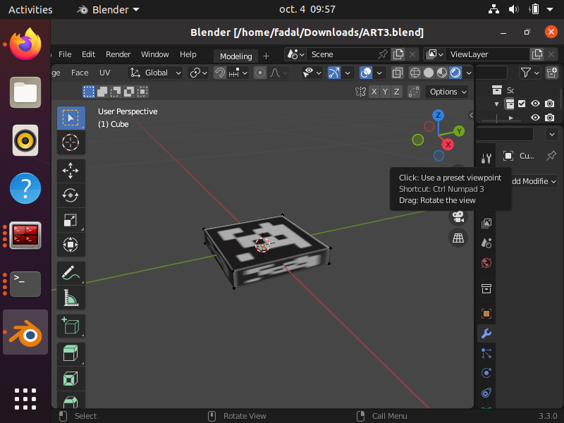

To spawn AR tags in gazebo, from question4 folder launch:

```
roslaunch spawn_Artags.launch
```
an AR tag box will appear in gazebo. 

To start the AR track package launch: 

```
ar_track_launch.launch
```

This code will start the tracking node using ar_track_alvar package; Using information from /ar_pose_marker topic.

To start the navigation toward the Ar tag, run: 

```
python3 Ar_track_1.py
```

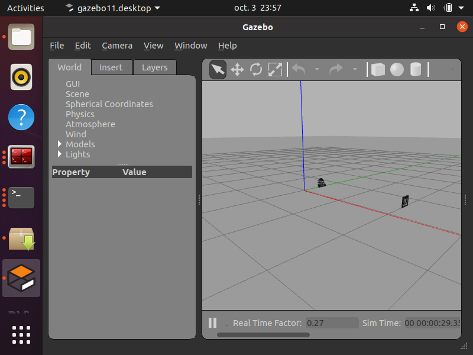


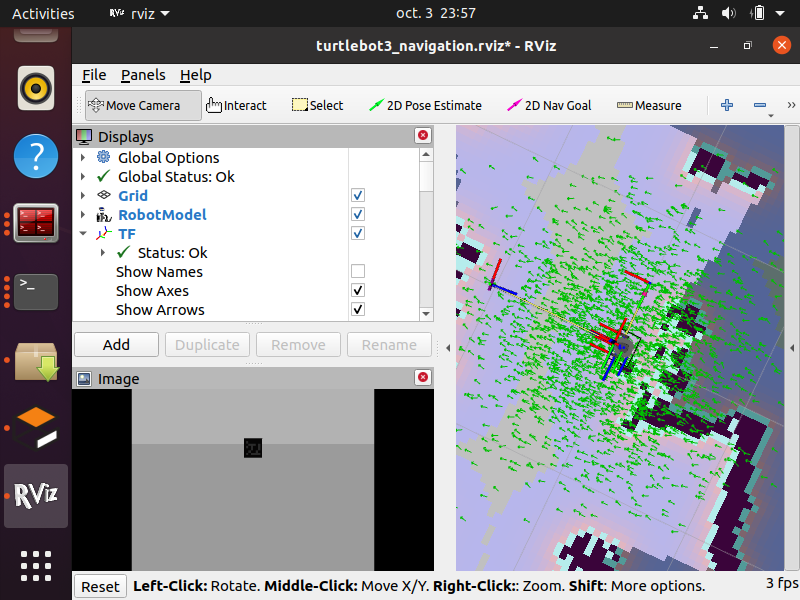


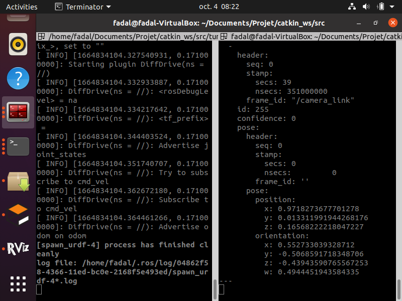

As shown in next figure, a camera was added to the turtlebot to visualize the Ar tag and track its position. 

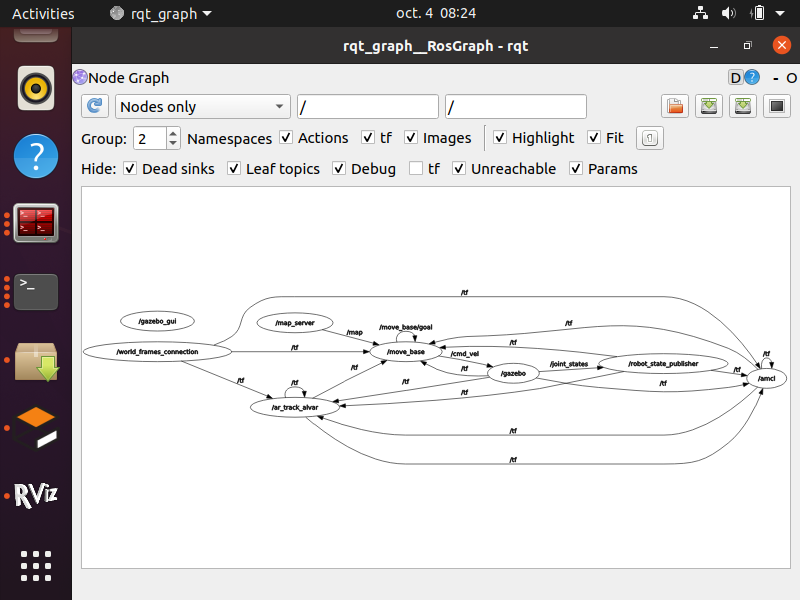

The camera communicates the position of the AR tag to ar_track_alvar which returns a distance between the robot and the AR tag.

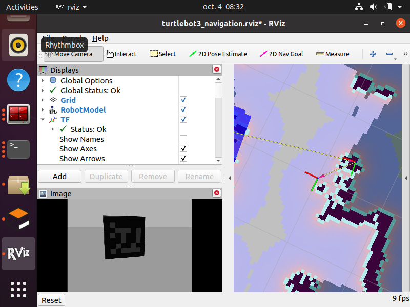

## Notes 
To run the Test, you can download the catkin workspace and run:
```
catkin_make
```
Note that for coding, xml was used for launch files and python was used for coding.

Note that on my PC, i have windows so i had to use a virtual machine to use Ubuntu. It was really hard workin on this project since VM is really slow. 

Please note also that, for the 4th question i tried to combine the 4th and the 6th question thus the use of the camera for the robot. 

### Time: 
Question 1 : 3 hours (Installation of the virtual machine, Ubuntu 20.04, ROS Noetic, Turtlebot3 packages, navigation set)

Question 2 : 4 hours (Learn about Topic_tools, coding of different nodes)

Question 3 : 5 days (5 hours a day) + 1 hours ( Learning about MQTT, Try diffrent packages, Coding, fixing errors) 

Question 4 : 7 days (5 hours a day) (blender install and preparing Ar tags boxes, install ar_track_alvar, coding)  
